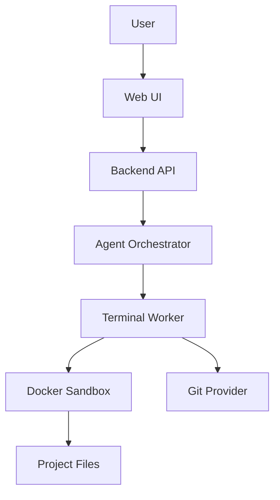

# Agentic Project Control Center  
## Web Tabanlı AI Yazılım Üretim ve Süreç Yönetim Sistemi

---

## 1. Proje Özeti

Bu projenin amacı, yazılım projelerini fikir aşamasından çalışan ürüne kadar yöneten, AI ajanlarıyla planlama, backlog oluşturma, görev dağıtımı, kod üretimi, terminal komutları, test süreçleri ve onay mekanizmalarını tek bir arayüzde birleştiren güçlü bir sistem geliştirmektir.

Sistem; Claude, GPT/Codex, Cursor, Gemini/Antigravity gibi farklı AI araçlarını tek bir operasyon paneli altında organize etmeyi hedefler.

Temel fikir şudur:

> Kullanıcı bir yazılım fikrini sisteme girer. Sistem bu fikri analiz eder, PRD üretir, teknik mimari çıkarır, backlog oluşturur, mikro tasklara böler, uygun ajanlara görev atar, terminal/worker ortamında proje dosyalarını oluşturur, testleri çalıştırır ve tüm süreci web panelinden izlenebilir hale getirir.

Bu ürün sadece bir chatbot değildir.  
Bu ürün sadece bir Kanban board değildir.  
Bu ürün sadece bir terminal değildir.

Bu ürünün hedef formu:

> AI destekli, insan onaylı, izlenebilir, güvenli ve ticari SaaS olarak satılabilir bir yazılım üretim operasyon merkezi.

---

## 2. Ürün Vizyonu

Ürün vizyonu:

> Bir yazılım fikrini alıp, sistematik şekilde planlayan, backlog’a bölen, teknik mimarisini çıkaran, ajan ekiplerine görev dağıtan, terminal üzerinden proje dosyalarını oluşturan, kod yazdıran, test eden ve tüm süreci kontrol panelinden izleten AI-native yazılım üretim platformu.

Alternatif ürün isimleri:

- Agentic Project Control Center
- AI Software Factory
- Agentic Development OS
- AI Project Builder Console
- Software Agent Operations Center
- Project-to-Code Automation Platform

En net MVP ismi:

> AI Project Builder Console

---

## 3. Temel Problem

Bugün yazılım geliştirirken birçok güçlü AI aracı var:

- ChatGPT
- Claude
- Codex
- Cursor
- Gemini
- Antigravity
- Copilot
- Local LLM araçları

Ancak sorun şu:

Bu araçlar güçlü olsa da dağınık çalışıyor.

Şu problemler ortaya çıkıyor:

1. Proje hafızası parçalanıyor.
2. Planlama ayrı yerde, kodlama ayrı yerde kalıyor.
3. Backlog ve AI görevleri birbirine bağlı değil.
4. AI çıktıları kayıt altına alınmıyor.
5. Hangi ajan ne yaptı bilinmiyor.
6. Terminal komutları güvenli şekilde yönetilmiyor.
7. İnsan onayı olmayan işlemler risk yaratıyor.
8. Proje kararları kayboluyor.
9. Kod, test, dokümantasyon ve release süreci kopuk ilerliyor.
10. AI ile yapılan işler tekrarlanabilir ve denetlenebilir değil.

Bu ürün bu dağınıklığı çözmek için geliştirilecektir.

---

## 4. Çözüm

Çözüm, web tabanlı bir operasyon paneli ile arkada çalışan güvenli bir terminal/worker sistemini birleştirmektir.

Sistem üç ana parçadan oluşur:

```text
1. Web Arayüzü
   - Proje yönetimi
   - Backlog
   - Agent Runner
   - Terminal logları
   - Dosya görüntüleme
   - Diagramlar
   - Approval Center
   - Wiki
   - Spec Editor

2. Orchestrator Katmanı
   - Planlama
   - Görev dağıtımı
   - Ajan seçimi
   - Context oluşturma
   - Prompt üretimi
   - Süreç yönetimi
   - State machine

3. Worker / Terminal Katmanı
   - Dosya oluşturma
   - Komut çalıştırma
   - Git işlemleri
   - Build/test çalıştırma
   - Docker sandbox
   - Log toplama
```

Ana prensip:

> Web panel karar ve izleme merkezidir. Worker/terminal katmanı üretim merkezidir.

---

## 5. Ürünün Ana Kullanıcıları

### 5.1 Solo Founder

Tek başına SaaS geliştirmek isteyen kullanıcı.

İhtiyacı:

- Fikrini netleştirmek
- PRD çıkarmak
- Backlog oluşturmak
- Kodlama görevlerini AI’a bölüştürmek
- Proje ilerlemesini izlemek
- Minimum ekip ile hızlı üretmek

### 5.2 Yazılım Ajansı

Birden fazla müşteri projesi yöneten ekipler.

İhtiyacı:

- Brief’ten PRD üretmek
- Müşteri isteklerini tasklara bölmek
- Teknik görevleri standartlaştırmak
- AI ile üretimi hızlandırmak
- Teslim sürecini izlemek

### 5.3 Kurumsal Yazılım Ekibi

AI kullanmak isteyen ama kontrolsüz otomasyondan çekinen ekipler.

İhtiyacı:

- AI işlemlerini loglamak
- Onay mekanizması kurmak
- Kod üretimini kontrol altında tutmak
- Güvenli terminal çalıştırmak
- Audit trail oluşturmak

### 5.4 Teknik Ürün Geliştirici

Yeni ürün fikrini hızlıca prototipe çevirmek isteyen kişi.

İhtiyacı:

- Planlama
- Teknik mimari
- Wireframe
- API listesi
- Database şeması
- İlk proje iskeleti

---

## 6. Ana Ürün Bileşenleri

---

# 6.1 Command Center

Command Center, projenin ana kontrol ekranıdır.

Burada kullanıcı tüm projenin durumunu görür.

Gösterilecek bilgiler:

```text
Project Name
Current Phase
Progress Percentage
Active Agents
Open Tasks
Blocked Tasks
Pending Approvals
Last Run Status
Test Status
Build Status
Risk Level
Next Recommended Action
```

Örnek ekran verisi:

```text
Project: Clinic SaaS
Phase: MVP Development
Progress: 34%
Active Agents: 4
Open Tasks: 27
Blocked Tasks: 3
Tests Passing: 82%
Next Approval: Run database migration
```

Command Center’ın amacı:

- Kullanıcıya projenin genel sağlığını göstermek
- Bir sonraki adımı netleştirmek
- AI ajanlarının ne yaptığını görünür kılmak
- Riskli veya bekleyen işleri öne çıkarmak

---

# 6.2 Ideation

Ideation bölümü, fikrin ilk girildiği yerdir.

Kullanıcı buraya basit bir fikir yazar:

```text
Klinikler için randevu, hasta takip ve ödeme modülü olan bir SaaS yapmak istiyorum.
```

Sistem bu fikri analiz eder ve şu çıktıları üretir:

- Problem tanımı
- Hedef kullanıcı
- Kullanıcı personları
- Ana özellikler
- MVP kapsamı
- Gelir modeli
- Rakip analizi taslağı
- Riskler
- Varsayımlar
- İlk ürün kapsamı

Ideation modülünün çıktısı PRD’ye temel oluşturur.

---

# 6.3 PRD Editor

PRD Editor, ürün gereksinim dokümanının üretildiği ve düzenlendiği yerdir.

PRD içeriği:

```text
1. Ürün adı
2. Ürün amacı
3. Hedef kullanıcılar
4. Problem tanımı
5. Çözüm önerisi
6. MVP kapsamı
7. MVP dışı kapsam
8. Ana özellikler
9. Kullanıcı akışları
10. Başarı metrikleri
11. Teknik varsayımlar
12. Riskler
13. Acceptance criteria
```

PRD Editor özellikleri:

- AI ile PRD üretme
- PRD üzerinde manuel düzenleme
- Bölüm bazlı yeniden üretme
- PRD’den backlog üretme
- PRD’den teknik mimari üretme
- PRD versiyon geçmişi

---

# 6.4 Spec Editor

Spec Editor, teknik ve fonksiyonel gereksinimlerin daha detaylı yazıldığı alandır.

İçerikler:

```text
Functional Requirements
Technical Requirements
API Specification
Database Requirements
UI Requirements
Security Requirements
Integration Requirements
Performance Requirements
Testing Requirements
Deployment Requirements
```

Örnek teknik gereksinim:

```text
Authentication modülü JWT tabanlı olacaktır.
Refresh token desteği olacaktır.
Kullanıcı şifresi BCrypt ile hash’lenecektir.
Login endpoint rate limit ile korunacaktır.
```

Spec Editor, geliştirici ajanların en önemli context kaynağıdır.

---

# 6.5 Architecture

Architecture bölümü sistem mimarisini üretir ve gösterir.

Çıktılar:

- Sistem mimarisi
- Modül yapısı
- Backend yapısı
- Frontend yapısı
- Database modeli
- API sınırları
- Deployment modeli
- Entegrasyonlar
- Güvenlik modeli
- Teknik karar kayıtları

Örnek mimari karar:

```text
Backend: .NET 8 Web API
Frontend: Next.js
Database: PostgreSQL
ORM: Entity Framework Core
Realtime: SignalR
Queue: Redis + Hangfire
Worker: Docker sandbox içinde çalışan .NET Worker
```

Architecture bölümünde ayrıca ADR kayıtları tutulur.

ADR örneği:

```text
ADR-001: PostgreSQL seçimi

Karar:
Ana veritabanı olarak PostgreSQL kullanılacaktır.

Sebep:
JSONB desteği, güçlü indexleme, açık kaynak ekosistemi ve SaaS projeleri için uygunluk.

Alternatifler:
SQL Server, MySQL, MongoDB.

Sonuç:
Entity Framework Core ile PostgreSQL kullanılacaktır.
```

---

# 6.6 Diagrams

Sistem otomatik diagramlar üretebilmelidir.

Başlangıç için Mermaid kullanılabilir.

Diagram türleri:

- System Architecture Diagram
- Database ERD
- User Flow
- Sequence Diagram
- Deployment Diagram
- Agent Workflow Diagram
- Module Dependency Diagram

Örnek Mermaid diagram:



Diagramlar hem dokümantasyon hem de ajan context’i için kullanılmalıdır.

---

# 6.7 Backlog Board

Backlog Board, sistemin proje yönetim merkezidir.

Kolonlar:

```text
Idea
Spec
Ready
In Progress
Review
Test
Done
Blocked
```

Her task kartında bulunması gereken alanlar:

```text
Task ID
Title
Description
Epic
Priority
Status
Assigned Agent
Dependencies
Risk Level
Acceptance Criteria
Estimated Effort
Actual Result
Test Status
Related Files
Related Runs
Approvals
```

Örnek task:

```text
Task ID: AUTH-003
Title: Login endpoint oluştur
Epic: Authentication
Priority: High
Assigned Agent: Backend Developer
Status: Ready
Acceptance Criteria:
- Kullanıcı email/password ile giriş yapabilmeli
- JWT access token dönmeli
- Hatalı şifrede 401 dönmeli
- Unit test yazılmalı
```

---

# 6.8 Micro Task Engine

Sistemin en önemli bölümlerinden biri Micro Task Engine’dir.

Bir epic’i küçük, çalıştırılabilir görevlere böler.

Örnek epic:

```text
Epic: Authentication
```

Üretilen mikro tasklar:

```text
AUTH-001: User entity oluştur
AUTH-002: Password hashing servisi yaz
AUTH-003: Register endpoint oluştur
AUTH-004: Login endpoint oluştur
AUTH-005: JWT token servisi oluştur
AUTH-006: Refresh token yapısını kur
AUTH-007: Auth middleware ekle
AUTH-008: Login formu oluştur
AUTH-009: Auth testlerini yaz
AUTH-010: Auth dokümantasyonu oluştur
```

Her mikro task şu formatta olmalıdır:

```json
{
  "id": "AUTH-004",
  "title": "Login endpoint oluştur",
  "goal": "Kullanıcının email ve şifre ile giriş yapmasını sağlamak",
  "inputs": ["User entity", "PasswordHasher", "JwtService"],
  "outputs": ["AuthController.Login", "LoginRequest", "LoginResponse"],
  "files": [
    "src/Modules/Auth/AuthController.cs",
    "src/Modules/Auth/LoginRequest.cs"
  ],
  "acceptanceCriteria": [
    "Doğru bilgilerle 200 döner",
    "Yanlış şifreyle 401 döner",
    "JWT token üretilir"
  ],
  "dependencies": ["AUTH-001", "AUTH-002", "AUTH-005"],
  "agent": "Backend Developer",
  "requiresApproval": false
}
```

---

# 6.9 Agent Runner

Agent Runner, ajanların çalıştırıldığı ve izlendiği ana ekrandır.

Her agent run kayıt altına alınmalıdır.

Gösterilecek bilgiler:

```text
Agent Name
Role
Current Task
Status
Started At
Finished At
Steps
Used Context
Generated Files
Executed Commands
Errors
Result
Next Action
Approval Required
```

Örnek Agent Runner ekranı:

```text
Agent: Backend Developer
Task: AUTH-004 Login endpoint oluştur
Status: Running

Step 1: Reading project context - Done
Step 2: Reading authentication spec - Done
Step 3: Generating AuthController.cs - Done
Step 4: Running dotnet test - Failed
Step 5: Analyzing error - Running
```

Agent Runner sadece chat ekranı olmamalıdır.  
Structured run mantığıyla çalışmalıdır.

---

# 6.10 Terminal

Terminal bölümü, arkadaki worker/sandbox ortamındaki komutları gösterir.

Özellikler:

- Canlı terminal çıktısı
- Komut geçmişi
- Komut onay sistemi
- Riskli komut engelleme
- Build/test logları
- Manuel komut çalıştırma
- Read-only mod
- Controlled execution mod

Terminal komutları doğrudan ana sunucuda çalıştırılmamalıdır.

Doğru yapı:

```text
Web UI
  ↓
Backend API
  ↓
Command Policy Engine
  ↓
Worker
  ↓
Docker Sandbox
  ↓
Project Directory
```

Riskli komut örnekleri:

```bash
rm -rf
drop database
delete from users
git push origin main
deploy production
chmod -R 777
curl unknown-script | bash
```

Bu komutlar otomatik çalıştırılmamalı, onaya düşmelidir.

---

# 6.11 Files / Workspace

Files bölümü, proje dosyalarının görüntülendiği alandır.

Özellikler:

- Dosya ağacı
- Dosya içeriği görüntüleme
- Diff görüntüleme
- Ajan tarafından oluşturulan dosyaları işaretleme
- Dosya geçmişi
- Task ile dosya ilişkisi
- Git diff entegrasyonu

Örnek dosya ağacı:

```text
clinic-saas/
  backend/
    src/
      Modules/
        Auth/
          AuthController.cs
          JwtService.cs
          User.cs
  frontend/
    app/
      login/
        page.tsx
  docs/
    PRD.md
    Architecture.md
  docker-compose.yml
  README.md
```

---

# 6.12 Approval Center

Approval Center, riskli veya önemli işlemlerin insan onayına düştüğü bölümdür.

Onay gerektiren işlemler:

```text
Database migration çalıştırma
Dosya silme
Production deploy
Secret/env değiştirme
Paket yükleme
Main branch’e push
PR merge
Payment sistemi değiştirme
Kullanıcı verisi işleme
External API key kullanma
```

Her onay kartında bulunmalı:

```text
İşlem adı
Neden gerekli
Etkilenecek dosyalar
Etkilenecek servisler
Risk seviyesi
Rollback planı
Komut önizlemesi
Ajan önerisi
Onayla / Reddet / Düzenle
```

Örnek:

```text
Approval Request: Run database migration

Reason:
Authentication modülü için Users ve RefreshTokens tabloları oluşturulacak.

Command:
dotnet ef database update

Risk:
Medium

Rollback:
dotnet ef database update PreviousMigration

Affected:
PostgreSQL development database
```

---

# 6.13 Context Center

Context Center, ajanların kullanacağı proje hafızasıdır.

İçerikler:

```text
Proje amacı
PRD
Teknik mimari
Kod standartları
Klasör yapısı
API kuralları
Database şeması
UI kuralları
Güvenlik kuralları
Ajan talimatları
Yasaklı işlemler
Prompt şablonları
Geçmiş kararlar
Task geçmişi
```

Context Center’ın amacı, ajanların rastgele değil, proje kurallarına bağlı çalışmasını sağlamaktır.

Örnek context:

```text
Kod standartları:
- Backend .NET 8 Web API ile yazılacak.
- Controller içinde business logic olmayacak.
- Servis katmanı kullanılacak.
- DTO kullanımı zorunlu.
- Entity doğrudan response olarak dönülmeyecek.
- Her endpoint için unit test yazılacak.
```

---

# 6.14 AI Profiles

AI Profiles bölümü, farklı ajan rollerinin tanımlandığı yerdir.

Örnek roller:

```text
Product Owner
System Architect
Scrum Master
Backend Developer
Frontend Developer
UI/UX Designer
QA Engineer
DevOps Engineer
Security Reviewer
Release Manager
```

Her profile şunları içermelidir:

```text
Role Name
Model Provider
Model Name
System Prompt
Allowed Tools
Forbidden Actions
Default Context
Output Format
Approval Rules
```

Örnek Backend Developer profili:

```text
Role:
Backend Developer

Model:
GPT / Codex

Amaç:
Verilen task’a göre backend kodu üretmek.

Kurallar:
- Mevcut mimariye bağlı kal.
- Gereksiz refactor yapma.
- Sadece task kapsamındaki dosyaları değiştir.
- Test yaz.
- Riskli işlem varsa onay iste.

Output:
- Yapılan değişiklikler
- Değişen dosyalar
- Test sonucu
- Riskler
- Sonraki öneri
```

---

# 6.15 Wiki

Wiki, proje dokümantasyonunun yaşadığı alandır.

İçerikler:

```text
Project Overview
Setup Guide
Architecture Notes
API Docs
Database Docs
Decision Logs
Release Notes
Developer Guide
Agent Instructions
Troubleshooting
```

Wiki AI tarafından güncellenebilir ama önemli değişiklikler onaya düşmelidir.

---

## 7. Ajan Rolleri

İlk sürümde çok fazla ajan olmamalıdır.

MVP için önerilen 5 ajan:

```text
1. Planner Agent
2. Product Owner Agent
3. Architect Agent
4. Developer Agent
5. QA / Reviewer Agent
```

Daha sonra genişletilebilir.

---

# 7.1 Planner Agent

Görevleri:

- Kullanıcı fikrini analiz eder
- Proje kapsamını çıkarır
- Büyük hedefleri belirler
- Roadmap önerir
- Modülleri belirler
- Riskleri çıkarır

Çıktıları:

```text
Project brief
MVP scope
Roadmap
Epic list
Risk list
Assumptions
```

---

# 7.2 Product Owner Agent

Görevleri:

- PRD yazar
- User story üretir
- Acceptance criteria yazar
- MVP kapsamını netleştirir
- Kullanıcı akışlarını çıkarır

Çıktıları:

```text
PRD
User stories
Acceptance criteria
Feature list
Out-of-scope list
```

---

# 7.3 Architect Agent

Görevleri:

- Teknik mimari belirler
- Backend/frontend yapısını tasarlar
- Database şeması önerir
- API sınırlarını belirler
- Deployment yapısını önerir
- ADR kayıtları oluşturur

Çıktıları:

```text
Architecture document
Database design
API design
Module map
Tech stack decision
ADR list
```

---

# 7.4 Developer Agent

Görevleri:

- Task bazlı kod üretir
- Dosya oluşturur
- Komut çalıştırır
- Testleri çalıştırır
- Hata alırsa analiz eder
- Düzeltme önerir

Çıktıları:

```text
Generated code
Changed files
Command logs
Test results
Error analysis
Next action
```

---

# 7.5 QA / Reviewer Agent

Görevleri:

- Acceptance criteria kontrol eder
- Test senaryosu üretir
- Kod review yapar
- Güvenlik risklerini işaretler
- Eksik dokümantasyonu bulur

Çıktıları:

```text
QA report
Review comments
Test checklist
Risk report
Approval recommendation
```

---

## 8. Elindeki AI Araçlarının Kullanımı

Mevcut hesapların rollerle eşleştirilmesi:

```text
Claude:
- PRD
- Mimari
- Uzun doküman analizi
- Risk analizi
- Code review

GPT / Codex:
- Kod üretimi
- Task parçalama
- Refactor
- Test yazma
- Backend/frontend geliştirme

Cursor:
- Kod tabanı içinde aktif geliştirme
- Çok dosyalı değişiklik
- Agentic coding
- Local repo işlemleri

Gemini / Antigravity:
- UI kontrol
- Browser test
- Görsel doğrulama
- Web akışlarının test edilmesi
```

Önerilen akış:

```text
Planlama: Claude
Backlog: GPT
Kodlama: Cursor / Codex
UI ve browser doğrulama: Gemini / Antigravity
Review: Claude + GPT
Son karar: İnsan
```

---

## 9. Teknik Mimari

Önerilen teknoloji stack’i:

```text
Frontend:
Next.js
React
Tailwind CSS
shadcn/ui

Backend:
.NET 8 veya .NET 9 Web API

Database:
PostgreSQL

ORM:
Entity Framework Core

Realtime:
SignalR

Queue:
Redis + Hangfire
veya
RabbitMQ + MassTransit

Worker:
.NET Worker Service
veya
Python worker
veya
Node.js worker

Terminal:
xterm.js
node-pty
WebSocket / SignalR stream

Sandbox:
Docker container per project

AI Providers:
OpenAI API
Anthropic API
Google Gemini API

Git:
GitHub API

Diagram:
Mermaid

Docs:
Markdown
```

---

## 10. Sistem Mimarisi

Genel sistem akışı:

```text
┌─────────────────────────────────────────────┐
│                 Web UI                      │
│ Dashboard | Kanban | Agent Runner | Logs    │
│ Terminal  | Files  | Diagrams | Approvals   │
└─────────────────────┬───────────────────────┘
                      │
┌─────────────────────▼───────────────────────┐
│              Backend API                    │
│ Projects | Tasks | Agents | Runs | Logs     │
│ Auth | Billing | Permissions | Audit        │
└─────────────────────┬───────────────────────┘
                      │
┌─────────────────────▼───────────────────────┐
│            Orchestrator Service             │
│ Planner | Router | Context Builder          │
│ Approval Manager | State Machine            │
└─────────────────────┬───────────────────────┘
                      │
┌─────────────────────▼───────────────────────┐
│              Worker Runtime                 │
│ Terminal Commands | File Ops | Git Ops      │
│ Test Runner | Build Runner | Docker         │
└─────────────────────┬───────────────────────┘
                      │
┌─────────────────────▼───────────────────────┐
│               Sandbox                       │
│ Isolated Project Folder / Docker Container  │
└─────────────────────────────────────────────┘
```

---

## 11. Backend Servisleri

Backend içinde önerilen servisler:

```text
ProjectService
IdeationService
PrdService
SpecService
ArchitectureService
BacklogService
TaskService
AgentProfileService
AgentRunService
ContextService
PromptEngineService
CommandService
ApprovalService
FileService
GitService
DiagramService
WikiService
AuditLogService
```

---

## 12. Veritabanı Modeli

Başlangıç tabloları:

```text
Users
Organizations
Projects
ProjectDocuments
Epics
Tasks
TaskDependencies
Agents
AgentProfiles
AgentRuns
AgentRunSteps
PromptTemplates
ContextDocuments
Artifacts
CommandLogs
Approvals
Files
FileChanges
Decisions
Diagrams
Repositories
AuditLogs
```

---

# 12.1 Projects

Alanlar:

```text
Id
OrganizationId
Name
Description
Status
TechStack
CreatedAt
UpdatedAt
```

---

# 12.2 Epics

Alanlar:

```text
Id
ProjectId
Title
Description
Priority
Status
Order
CreatedAt
UpdatedAt
```

---

# 12.3 Tasks

Alanlar:

```text
Id
ProjectId
EpicId
Title
Description
Status
Priority
AssignedAgentProfileId
AcceptanceCriteria
Dependencies
RiskLevel
EstimatedEffort
CreatedAt
UpdatedAt
```

---

# 12.4 AgentRuns

Alanlar:

```text
Id
ProjectId
TaskId
AgentProfileId
Status
InputPrompt
OutputSummary
StartedAt
FinishedAt
RequiresApproval
ErrorMessage
```

---

# 12.5 AgentRunSteps

Alanlar:

```text
Id
AgentRunId
StepName
Status
Input
Output
StartedAt
FinishedAt
ErrorMessage
```

---

# 12.6 CommandLogs

Alanlar:

```text
Id
ProjectId
AgentRunId
Command
WorkingDirectory
Output
ExitCode
RiskLevel
ApprovalId
StartedAt
FinishedAt
```

---

# 12.7 Approvals

Alanlar:

```text
Id
ProjectId
RequestedByAgentRunId
ActionType
Title
Description
RiskLevel
CommandPreview
AffectedFiles
RollbackPlan
Status
ApprovedByUserId
CreatedAt
ResolvedAt
```

---

# 12.8 Decisions

Alanlar:

```text
Id
ProjectId
Title
Decision
Reason
Alternatives
Consequences
CreatedBy
CreatedAt
```

---

## 13. Prompt Engine

Prompt Engine, her task için doğru context’i toplayıp uygun ajana görev paketi üretir.

Girdi kaynakları:

```text
Project PRD
Architecture document
Spec document
Task description
Acceptance criteria
Related files
Coding standards
Previous decisions
Agent profile
```

Örnek Developer prompt formatı:

```text
Sen bir .NET Backend Developer ajanısın.

Proje:
{{ProjectName}}

Teknoloji:
{{TechStack}}

Görev:
{{TaskTitle}}

Açıklama:
{{TaskDescription}}

Acceptance Criteria:
{{AcceptanceCriteria}}

İlgili Mimari:
{{ArchitectureContext}}

Kod Kuralları:
{{CodingStandards}}

İlgili Dosyalar:
{{RelatedFiles}}

Yapman gerekenler:
1. Sadece bu task kapsamındaki değişiklikleri yap.
2. Mevcut mimariye bağlı kal.
3. Gerekirse test yaz.
4. Riskli işlem varsa çalıştırma, onay iste.
5. Çıktını aşağıdaki JSON formatında ver.

Output Format:
{
  "summary": "",
  "changedFiles": [],
  "commandsToRun": [],
  "tests": [],
  "risks": [],
  "requiresApproval": false,
  "nextAction": ""
}
```

---

## 14. Workflow

Ana kullanım akışı:

```text
1. Kullanıcı yeni proje oluşturur.
2. Proje fikrini Ideation ekranına yazar.
3. Sistem PRD üretir.
4. Kullanıcı PRD’yi onaylar veya düzenler.
5. Sistem teknik mimari üretir.
6. Sistem diagramlar üretir.
7. Sistem epic ve taskları üretir.
8. Kullanıcı backlog’u onaylar.
9. Sistem taskları ajanlara atar.
10. Ajanlar sırayla çalışır.
11. Worker gerekli dosyaları oluşturur.
12. Terminal komutları çalışır.
13. Test sonuçları kaydedilir.
14. Riskli işlemler onaya düşer.
15. Kullanıcı diff ve logları inceler.
16. Task review/test/done aşamalarından geçer.
17. Sistem release notu ve wiki güncellemesi üretir.
```

---

## 15. Terminal Worker Tasarımı

Worker sistemi çok dikkatli tasarlanmalıdır.

Temel kurallar:

```text
Her proje izole çalışmalı.
Komutlar loglanmalı.
Riskli komutlar policy’den geçmeli.
Ana sunucuya doğrudan erişim olmamalı.
Dosya erişimi proje klasörüyle sınırlı olmalı.
Network erişimi kontrollü olmalı.
```

MVP için öneri:

```text
Docker container per project
Mounted project directory
Restricted command execution
SignalR ile canlı log stream
Command policy middleware
```

Worker’ın yapabilecekleri:

```text
Dosya oluşturma
Dosya okuma
Dosya güncelleme
Komut çalıştırma
Build alma
Test çalıştırma
Git status alma
Git diff alma
Branch oluşturma
PR hazırlama
```

Worker’ın otomatik yapmaması gerekenler:

```text
Production deploy
Database drop
Secret değiştirme
Main branch push
Dosya toplu silme
External script çalıştırma
```

---

## 16. Güvenlik Modeli

Yetki seviyeleri:

```text
Level 0: Plan only
Level 1: Read files
Level 2: Write files
Level 3: Run safe commands
Level 4: Run tests/builds
Level 5: Git branch/PR
Level 6: Database migration with approval
Level 7: Deploy with approval
```

Varsayılan güvenlik:

```text
Ajanlar plan yapabilir.
Ajanlar dosya okuyabilir.
Ajanlar proje klasöründe dosya yazabilir.
Ajanlar güvenli komutları çalıştırabilir.
Riskli işlemler onay ister.
Production işlemleri her zaman onay ister.
```

Riskli komut örnekleri:

```text
rm
rmdir
del
drop database
truncate
delete without where
git push main
deploy production
curl | bash
chmod 777
```

---

## 17. MVP Kapsamı

İlk sürümde yapılacaklar:

```text
1. Kullanıcı proje oluşturabilsin.
2. Proje fikri girilebilsin.
3. AI ile PRD üretilebilsin.
4. PRD’den epic/task üretilebilsin.
5. Kanban board gösterilebilsin.
6. Task detay sayfası olsun.
7. Her task için prompt paketi üretilebilsin.
8. Ajan profilleri tanımlanabilsin.
9. Agent run kayıt altına alınabilsin.
10. Terminal logları gösterilebilsin.
11. Dosya diff görüntülenebilsin.
12. Approval Center çalışsın.
13. Mermaid diagram üretilebilsin.
14. Wiki sayfası oluşsun.
```

İlk sürümde yapılmayacaklar:

```text
Tam otonom production deploy
Enterprise role management
Marketplace
Çok karmaşık multi-agent framework
Kendi IDE editörünü sıfırdan yapmak
Çoklu tenant billing sistemi
Gelişmiş analytics
```

---

## 18. 30 Günlük Aksiyon Planı

---

# Hafta 1: Temel Zemin

Amaç:

Manuel proje ve task yönetimi çalışan bir temel sistem kurmak.

Yapılacaklar:

```text
- Next.js projesi oluştur
- .NET Web API oluştur
- PostgreSQL bağlantısı kur
- Entity Framework Core ekle
- Projects tablosu oluştur
- Epics tablosu oluştur
- Tasks tablosu oluştur
- Basit Kanban UI oluştur
- Task oluşturma/düzenleme/silme ekranı yap
- Project detay ekranı yap
```

Hafta sonu hedefi:

```text
Kullanıcı manuel olarak proje oluşturabilmeli.
Task ekleyebilmeli.
Taskları Kanban kolonları arasında taşıyabilmeli.
```

---

# Hafta 2: AI Planlama

Amaç:

Kullanıcı fikrinden PRD ve backlog üretmek.

Yapılacaklar:

```text
- AI provider abstraction oluştur
- Claude/OpenAI API bağlantısını kur
- Ideation ekranı yap
- PRD generation servisi yaz
- PRD Editor ekranını yap
- PRD’den epic/task üretme servisi yaz
- Üretilen taskları database’e kaydet
```

Hafta sonu hedefi:

```text
Kullanıcı fikrini yazacak.
Sistem PRD üretecek.
Sistem taskları otomatik Kanban board’a ekleyecek.
```

---

# Hafta 3: Agent Runner ve Prompt Engine

Amaç:

Task bazlı ajan çalışma sistemini kurmak.

Yapılacaklar:

```text
- AgentProfiles tablosu oluştur
- PromptTemplates tablosu oluştur
- ContextDocuments tablosu oluştur
- PromptEngineService yaz
- AgentRun kayıt sistemi oluştur
- AgentRunSteps tablosu oluştur
- Agent Runner UI yap
- Task için "Generate Prompt" butonu ekle
- Task için "Run Agent" akışı başlat
```

Hafta sonu hedefi:

```text
Bir task seçildiğinde sistem uygun ajan için güçlü bir prompt paketi üretebilmeli.
Agent run kayıt altına alınmalı.
```

---

# Hafta 4: Terminal Worker ve Approval

Amaç:

Kontrollü terminal ve onay sistemini kurmak.

Yapılacaklar:

```text
- Worker service oluştur
- Docker sandbox yapısını kur
- Komut çalıştırma servisi yaz
- CommandLogs tablosu oluştur
- SignalR ile canlı terminal log stream yap
- Approval tablosu oluştur
- Approval Center UI yap
- Riskli komut policy sistemi yaz
- Basit file diff ekranı yap
```

Hafta sonu hedefi:

```text
Sistem güvenli komutları sandbox içinde çalıştırabilmeli.
Terminal logları web UI’da canlı görülebilmeli.
Riskli komutlar onaya düşmeli.
```

---

## 19. 90 Günlük Yol Haritası

---

# Ay 1: MVP

Çıktı:

```text
Proje oluşturma
PRD üretme
Backlog oluşturma
Kanban
Prompt Engine
Agent Runner
Basit terminal log
Approval Center
```

---

# Ay 2: Kod Üretim ve Git Entegrasyonu

Yapılacaklar:

```text
GitHub repo bağlama
Branch oluşturma
Dosya diff gösterme
PR hazırlama
Test komutları çalıştırma
Build logları
QA report üretme
Mermaid diagramlar
Wiki otomasyonu
```

---

# Ay 3: Pilot Kullanım ve Ürünleştirme

Yapılacaklar:

```text
Gerçek bir SaaS projesi üzerinde test
Prompt template iyileştirme
Agent profile iyileştirme
Kullanıcı onboarding
Demo proje şablonları
Billing hazırlığı
Landing page
Private beta
```

---

## 20. İlk Demo Senaryosu

Demo için önerilen proje:

```text
Mini CRM SaaS
```

Demo kapsamı:

```text
Authentication
Customer management
Contact management
Simple dashboard
PostgreSQL database
.NET Web API backend
Next.js frontend
Docker compose
README
Basic tests
```

Demo akışı:

```text
1. Kullanıcı “Mini CRM SaaS yapmak istiyorum” der.
2. Sistem PRD üretir.
3. Sistem mimari üretir.
4. Sistem database diagramı üretir.
5. Sistem backlog oluşturur.
6. Kullanıcı planı onaylar.
7. Sistem auth modülü tasklarını başlatır.
8. Worker proje klasörünü oluşturur.
9. Backend ve frontend iskeleti oluşturulur.
10. Test komutları çalışır.
11. Sonuçlar Agent Runner’da gösterilir.
```

---

## 21. Ticari Konumlandırma

Ürünün ana mesajı:

> AI ajanlarını kullanarak yazılım projelerini fikirden çalışan ürüne kadar planlayan, yöneten ve kontrollü şekilde üreten operasyon paneli.

Alternatif pazarlama mesajları:

```text
Turn software ideas into structured, executable development plans.
Plan, build, test and track AI-generated software projects from one control center.
AI agents for software teams, with human approval and full audit logs.
Your AI-native project manager, architect, developer and QA team in one dashboard.
```

Türkçe mesaj:

```text
Yazılım fikrini gir, sistem PRD’yi yazsın, backlog’u oluştursun, ajanlara görev dağıtsın, kod üretimini izlenebilir hale getirsin.
```

---

## 22. Fiyatlandırma Fikirleri

Başlangıç paketleri:

```text
Free:
- 1 proje
- Manuel prompt generation
- Sınırlı AI run

Pro:
- 10 proje
- AI PRD/backlog generation
- Agent Runner
- Terminal logs
- GitHub entegrasyonu

Team:
- Çoklu kullanıcı
- Approval workflow
- Audit logs
- Private workspaces
- Gelişmiş agent profiles

Enterprise:
- On-prem / private cloud
- Custom model provider
- SSO
- Advanced permissions
- Compliance logs
```

---

## 23. Riskler

Teknik riskler:

```text
AI çıktılarının hatalı olması
Terminal komutlarının riskli olması
Sandbox güvenliği
Prompt maliyetleri
Uzun context yönetimi
Kod kalitesi
Çok fazla ajan karmaşası
```

Ürün riskleri:

```text
Kullanıcının ne yapacağını anlamaması
Çok karmaşık UI
AI otomasyonuna güven eksikliği
Rakiplerin hızlı gelişmesi
API maliyetlerinin yüksek olması
```

Azaltma yöntemleri:

```text
MVP’yi sade tut
İnsan onayı zorunlu yap
Her şeyi logla
Task bazlı çalış
Küçük ajan sayısıyla başla
Güvenli sandbox kullan
Kod diff ve test sonuçlarını göster
```

---

## 24. Kritik Ürün İlkeleri

Bu ürün şu ilkelere göre geliştirilmelidir:

```text
1. Önce plan, sonra kod.
2. Her task küçük ve ölçülebilir olmalı.
3. Her ajan çıktısı kayıt altına alınmalı.
4. Her komut loglanmalı.
5. Riskli işlem onay istemeli.
6. Kullanıcı ne olduğunu her an görebilmeli.
7. Sistem chat değil, operasyon paneli olmalı.
8. Ajanlar serbest değil, rol ve yetki bazlı çalışmalı.
9. Kod üretimi context’e bağlı olmalı.
10. İnsan son karar verici olmalı.
```

---

## 25. Sonuç

Bu proje güçlü bir SaaS ürününe dönüşebilir.

En doğru ürün formu:

```text
Web tabanlı Agentic Project Management + Controlled Terminal Execution platformu.
```

Yani:

```text
Ne sadece terminal.
Ne sadece Python UI.
Ne sadece Kanban.
Ne sadece chatbot.
```

Doğru yapı:

```text
Web UI
+ Agent Runner
+ Sandbox Terminal
+ Backlog
+ Spec Editor
+ Architecture
+ Diagram
+ Approval Center
+ Logs
+ Wiki
```

İlk hedef:

> Bir yazılım fikrini alıp, PRD’ye dönüştüren, backlog oluşturan, görevleri ajanlara bölen, güvenli terminal worker ile proje iskeletini kuran ve tüm süreci izlenebilir yapan bir MVP geliştirmek.

Bu MVP tamamlandığında ürün hem kişisel kullanım için çok değerli olur hem de ticari SaaS’a çevrilebilir.

---