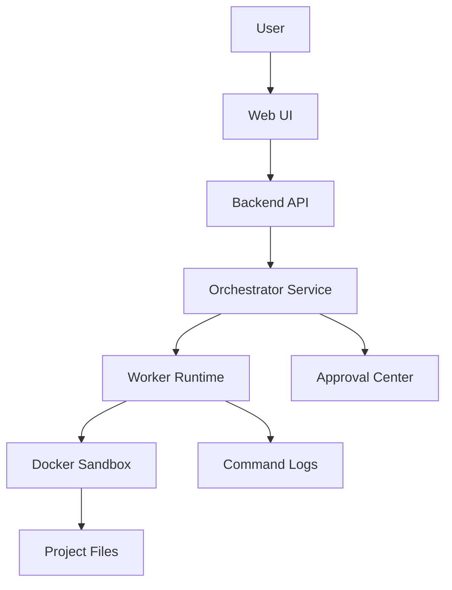

# System Architecture

## Genel Mimari

```text
Web UI
  -> Backend API
  -> Orchestrator Service
  -> Worker Runtime
  -> Sandbox
```

## Katmanlar

### Web UI

Kullanıcının karar verdiği ve süreci izlediği ana paneldir.

Ekranlar:

- Dashboard / Command Center.
- Kanban Board.
- Agent Runner.
- Approvals.
- PRD and Spec Editor.
- Wiki.
- Logs.

### Backend API

Projeleri, taskları, ajan profillerini, run kayıtlarını, logları ve approval süreçlerini yönetir.

Önerilen teknoloji:

```text
.NET 8 veya .NET 9 Web API
PostgreSQL
Entity Framework Core
SignalR
```

### Orchestrator Service

Planlama, task routing, context hazırlama ve approval kararlarını yönetir.

Sorumluluklar:

- Planner.
- Task router.
- Context builder.
- Prompt engine.
- Approval manager.
- State machine.

### Worker Runtime

Dosya ve terminal işlemlerinin yürütüldüğü katmandır.

Sorumluluklar:

- Dosya okuma/yazma.
- Komut çalıştırma.
- Build/test çalıştırma.
- Git işlemleri.
- Log stream.

### Sandbox

Her proje izole ortamda çalışmalıdır. MVP için Docker container yeterlidir.

## Temel Prensip

Web panel karar merkezidir. Worker üretim merkezidir. Orchestrator ise bu ikisinin arasındaki kural ve süreç katmanıdır.

## Mermaid


