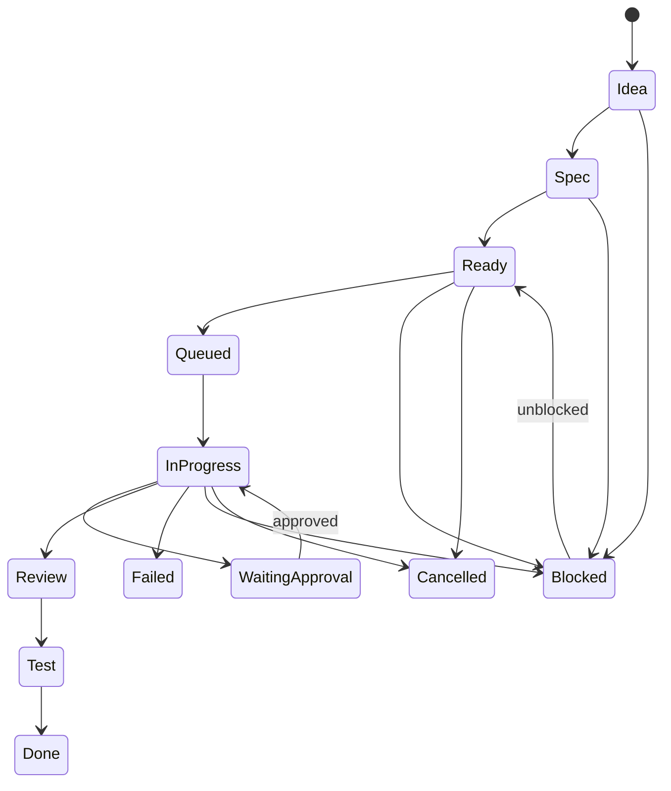

# State Machine

Bu doküman, task, agent run, approval, command ve release durumlarını standartlaştırır.

## Task State Machine

### State Listesi

- Idea
- Spec
- Ready
- Queued
- In Progress
- Waiting Approval
- Review
- Test
- Done
- Failed
- Blocked
- Cancelled

### Geçiş Kuralları

- `Idea -> Spec`: scope çalışması başlar.
- `Spec -> Ready`: acceptance criteria, risk ve ajan rolü netleşmiştir.
- `Ready -> Queued`: task agent run için sıraya alınır.
- `Queued -> In Progress`: çalışma başlar.
- `In Progress -> Waiting Approval`: riskli command/action gerekir.
- `Waiting Approval -> In Progress`: approval approved olur.
- `In Progress -> Review`: çıktı üretilir.
- `Review -> Test`: review sonrası validation başlar.
- `Test -> Done`: acceptance criteria geçer.
- Her state -> `Blocked`: bağımlılık veya eksik bilgi vardır.
- Her active state -> `Cancelled`: kullanıcı veya sistem iptal eder.

### Yasak Geçişler

- `Idea -> Done`
- `Spec -> In Progress`
- `Waiting Approval -> Done`
- `Failed -> Done` validation olmadan

### Audit Log

Task create, update, transition, blocked, cancelled ve done durumlarında audit log yazılır.

### İnsan Onayı

`Waiting Approval` state her zaman insan onayı gerektirir.

## Agent Run State Machine

### State Listesi

- Created
- Context Building
- Prompt Generated
- Agent Running
- Tool Execution
- Command Running
- Waiting Approval
- Completed
- Failed
- Cancelled

### Geçiş Kuralları

- `Created -> Context Building`
- `Context Building -> Prompt Generated`
- `Prompt Generated -> Agent Running`
- `Agent Running -> Tool Execution`
- `Tool Execution -> Command Running`
- `Command Running -> Waiting Approval` riskli komut varsa
- `Command Running -> Completed` safe command başarılıysa
- Her active state -> `Failed` hata varsa
- Her active state -> `Cancelled` kullanıcı iptal ederse

### Yasak Geçişler

- `Created -> Completed`
- `Waiting Approval -> Command Running` approved olmadan
- `Failed -> Completed` yeni validation olmadan

### Audit Log

Run created, prompt generated, command requested, completed, failed ve cancelled olaylarında audit log yazılır.

### İnsan Onayı

Tool veya command execution riskliyse `Waiting Approval` gerekir.

## Approval State Machine

### State Listesi

- Pending
- Approved
- Rejected
- Changes Requested
- Expired
- Cancelled

### Geçiş Kuralları

- `Pending -> Approved`
- `Pending -> Rejected`
- `Pending -> Changes Requested`
- `Pending -> Expired`
- `Pending -> Cancelled`
- `Changes Requested -> Pending` güncellenmiş request ile

### Yasak Geçişler

- `Approved -> Rejected`
- `Rejected -> Approved`
- `Expired -> Approved`

### Audit Log

Tüm approval kararları audit log yazmalıdır.

### İnsan Onayı

`Approved`, `Rejected` ve `Changes Requested` sadece yetkili kullanıcı tarafından verilebilir.

## Command State Machine

### State Listesi

- Previewed
- Queued
- Waiting Approval
- Running
- Succeeded
- Failed
- Blocked
- Cancelled

### Geçiş Kuralları

- `Previewed -> Queued` command safe ise
- `Previewed -> Waiting Approval` command riskli ise
- `Previewed -> Blocked` command blocked ise
- `Queued -> Running`
- `Running -> Succeeded`
- `Running -> Failed`
- `Waiting Approval -> Queued` approval approved ise
- Her active state -> `Cancelled`

### Yasak Geçişler

- `Blocked -> Running`
- `Waiting Approval -> Running` approval olmadan
- `Succeeded -> Running`

### Audit Log

Previewed, blocked, approval required, running, succeeded ve failed durumlarında audit log yazılır.

### İnsan Onayı

Risky/approval required command için onay gerekir.

## Release State Machine

### State Listesi

- Draft
- Candidate
- Waiting Approval
- Approved
- Released
- Failed
- Rolled Back
- Cancelled

### Geçiş Kuralları

- `Draft -> Candidate`
- `Candidate -> Waiting Approval`
- `Waiting Approval -> Approved`
- `Approved -> Released`
- `Released -> Rolled Back` rollback gerekiyorsa
- Her active state -> `Cancelled`
- Release pipeline hata alırsa `Failed`

### Yasak Geçişler

- `Draft -> Released`
- `Waiting Approval -> Released`
- `Failed -> Released` yeniden validation olmadan

### Audit Log

Release candidate, approval, released, failed ve rollback olayları audit log yazmalıdır.

### İnsan Onayı

Production deploy ve release tag her zaman insan onayı gerektirir.

## Mermaid Diagram

## Related Documents

- [Task Lifecycle](task_lifecycle.md)
- [Run Lifecycle](run_lifecycle.md)
- [Approval Lifecycle](approval_lifecycle.md)
- [Command Policy](command_policy.md)
